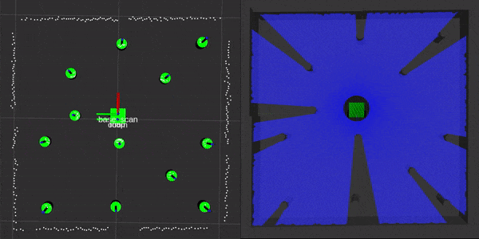
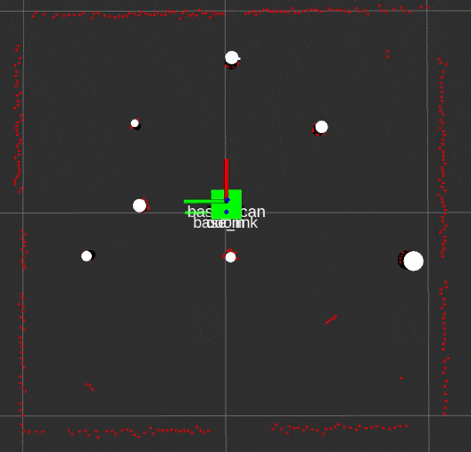

# Navigation in ROS from Scratch

## Description
This repository contains files that that implements odometry and EKF SLAM for a differential drive robot, as well as various supporting libraries and testing nodes. Currently, there is no path planning implementation. The currently repository also contains files to run everything on the TurtleBot3 Burger.

### Summary Videos:
- [SLAM Demo](https://www.youtube.com/watch?v=SxR_UP2P1BQ)
- [Odometry Demo](https://www.youtube.com/watch?v=V_Ljk7B5whE)

## Packages
Here is a high level description of each package, more details for the nodes and libraries can be found in the [API](https://rencheckyoself.github.io/turtlebot3-navigation/index.html).

- `rigid2d`: This package contains nodes and libraries that support all of the odometry based functions.
- `nuslam`: This package contains nodes and libraries that support all of the SLAM based functions.
- `tsim`: This package contains nodes to test various features of the rigid2d package using the built in turtle sim in ROS.
- `nuturtle_robot`: This package contains nodes to interface the odometry and SLAM packages to the TurtleBot3.
- `nuturtle_gazebo`: This package contains a gazebo plugin to run a TurtleBot3 in simulation using the existing files.
- `nuturtle_description`: This package contains all files relevant to the robots visualizations.

Select libraries and functions also have accompanying test files usings `gtest` and `rostest`.

## Outside Software

## How to use this repo:
If you only want to use the simulation options instead of the real world options, everything will be functional as long as you have `ROS Melodic`. In order to also run everything on the turtlebot, you will need to install [this](https://github.com/ME495-Navigation/OpenCR) custom firmware on your turtlebot. In order to run wirelessly, follow these [instructions](https://nu-msr.github.io/navigation_site/homework02.html#task-f.001-a-new-workspace) for connecting and cross compiling.

### 1) Get all of the necessary files.

Use the nuturtle.rosinstall file to clone this repo as well a peripheral one that contains some custom messages

### 2) Launch something!

#### The main launch files:

- `nuslam/slam.launch`: This file will run the full SLAM implementation along side a comparison to only odometry. It currently uses the keyboard teleop control to send velocity commands to the turtlebot.

  ##### Parameters:
  - robot: Use a value of -1 to launch everything based on a gazebo simulation. Using a number > 0 will launch everything using a robot in the real world.
  - debug: Use 1 to feed the SLAM node groundtruth data to do the pose estimation. Use 0 to feed SLAM the slam node data from the actual laser scanner.  

- `nuturtle_robot/follow_waypoints.launch`: This file will run a waypoint following script that uses only odometry to estimate the robot pose as it follows a list of waypoints and compares the pose to the 'perfect' robot (nodes in the `fake` namespace). Once launched, call the `/start` service to actually start sending velocity commands. Once the path has been completed, call `/start` again to complete another loop. Currently only proportional control is used to follow the waypoints.

  To use this file with the simulated robot, just launch `nuturtle_gazebo/gazebo_waypoints.launch`. No need to pass any arguments.

  ##### Parameters:
  - robot: Using a number > 0 will launch everything using a robot in the real world. See the lower section for how to set this up. 0 will launch everything only on the local machine and should only be used for testing or running locally on the turtlebot.
  - with_rviz: Use True to also launch rviz.

#### The other launch files:

`nuslam`:
  - `landmarks.launch`: test laser scan landmark detection and visualization
  - `analysis_landmarks.launch`: test gazebo landmark data conversion and visualization
`nuturtle_description`:
  - `view_diff_drive.launch`: view the robot urdf file in rviz

`nuturtle_gazebo`:
  - `diff_drive_gazebo.launch`: test file for plugin development

`nuturtle_robot`:
  - `basic_remote.launch`: used to configure the interface between the real robot and your computer for running remotely.
  - `teleop_turtle.launch`: used to launch odometry with turtlebot3's keyboard teleop node.
  - `test_movement.launch`: used to test the interface between the robot sensor data and the odometry calculations.

`tsim`:
  - `trect.launch`: uses turtle sim to test the rigid2d and diff drive libraries with feed-forward control.
  - `turtle_odom.launch`: uses turtle sim to test the odometer and encoder simulation node.
  - `turtle_pent.launch`: uses turtle sim to test waypoint following library.

## Under the hood:

All of the odometry calculations are built on the conversions from the desired body velocity to individual wheel velocity commands that actually are sent to the robot. The derivation for this can be found [here](nuturtle_robot/doc/Kinematics.pdf) in the rigid2d package.

This SLAM implementation is using an EKF to perform the pose estimation for the robot and each landmark. [Here](https://nu-msr.github.io/navigation_site/slam.pdf) is a detailed resource for practically implementing the EKF.  

Simulation results using the groundtruth data from gazebo:

Since there in no noise on from the groundtruth data, the landmark position estimates stay virutally still. This results in a near perfect robot pose estimate from the EKF SLAM algorithm.

Simulation results using the laser scan data from the simulated sensor:

Due to sensor noise, the landmark detection now experience variance in the data fed to the SLAM measurement update. Also, the laser scan data is not being adjusted based on the robot's movement while the scan is taking place. This also contributes to the shifting of the map.

This implementation has the constraint that all of the landmarks it expects to see are cylindrical pillars of a uniform radius. The landmarks are identified using laser scan data reported by the simulation/real robot. First the laser scan data is divided into clusters based on the range values reported by the scanner. If a cluster has more than 3 data points it is then processed using a circle fitting algorithm based on this [practical guide](https://nu-msr.github.io/navigation_site/circle_fit.html) to identify the center and estimated radius. For more information on the circle fitting see this [paper](https://projecteuclid.org/euclid.ejs/1251119958) and related [website](https://people.cas.uab.edu/~mosya/cl/CPPcircle.html). After fitting the circle any fit with a radius greater than the threshold parameter is discarded. Initially, a [classification algorithm](http://miarn.sourceforge.net/pdf/a1738b.pdf) based on this paper was also implemented, but it yielded worse results than screening by radius in this application since the approximate size of each landmark is known. A more advanced classification scheme would be more useful when running the robot in a real world as seen by all of the false positive readings in summary video.

In order to associate incoming data with the current estimation of the landmark states, the Mahalanobis distance was used. While this method is more complex than just comparing the physical distance, it has the advantage of taking into account the covariance of the estimated pose. See this [resource](https://nu-msr.github.io/navigation_site/data_assoc.html) for how to implement this type of data association. If the distance between a data point and an estimated landmark is under a minimum threshold it is considered a match to an existing landmark. If the distance between a data point and all estimated landmarks is greater than a maximum threshold it is considered a new landmark. These parameters will likely change based on the environment the robot is operating in to yield optimal results.

## Future Development

- Further testing for landmark culling to reliably remove false positive landmarks from the state vector.

- Implement a more robust method for adding landmarks to the state vector. E.g. require the potential new landmark to be seen three consecutive times before officially adding it to the state vector.

- Change driving functionality to waypoint-based navigation goals.

- Implement a global planner so the robot can operate autonomously and avoid obstacles while moving to waypoints.
