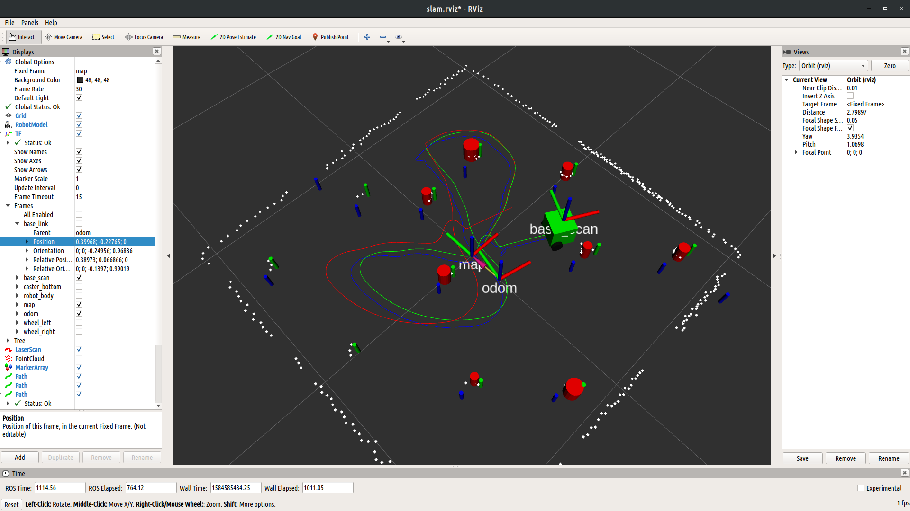

# SLAM Results

## Task S.002
- Error between Odom and Groundtruth:
  - x: -0.2048m
  - y: 0.1861m
  - th: -5.12 deg
- Error between GT and SLAM:
  - x: -0.0022m
  - y: -0.0015m
  - th: -0.077 deg

- Used a landmark radius of 1m, a process noise of 1e-7 and a sensor noise of 1e-3


### Raw Data
```
odom
position:
  x: -0.754461193938
  y: 0.454129666982
  z: 0.0
orientation:
  x: 0.0
  y: 0.0
  z: 0.791816815504
  w: 0.610758651748
  th: 104.71 deg

GT:
position:
  x: -0.549626509948
  y: 0.268054938451
  z: 1.38999656303e-05
orientation:
  x: 0.00437982122201
  y: -0.00307718812761
  z: -0.818230862012
  w: -0.574864857623
  th: 109.8250159 deg

SLAM:
position:
x: -0.55192
y: 0.26648
z: 0
orientation:
x: 0
y: 0
z: 0.81789
w: 0.57538
th: 109.7477534 deg
```
## Task S.003

- Error between Odom and Groundtruth:
  - x: −0.0233m
  - y: 0.2745m
  - th: 12.95 deg
- Error between GT and SLAM:
  - x: −0.0133m
  - y: −0.0197m
  - th: −0.0073 deg



### Raw Data
```
odom
position:
  x: 0.389730911432
  y: 0.0668660454376
  z: 0.0
orientation:
  x: 0.0
  y: 0.0
  z: -0.139699475053
  w: 0.990193949017
  th = -16 deg

GT:
position:
  x: 0.413032529492
  y: -0.207684601927
  z: 1.39265311303e-05
orientation:
  x: 0.00133846693082
  y: 0.00518285041226
  z: -0.250025927102
  w: 0.968224345049
  th: -28.9584994 deg

SLAM:
position:
x: 0.39977
y: -0.22739
z: 0
orientation:
x: 0
y: 0
z: -0.25009
w: 0.96822
th: -28.9657503 deg
```
