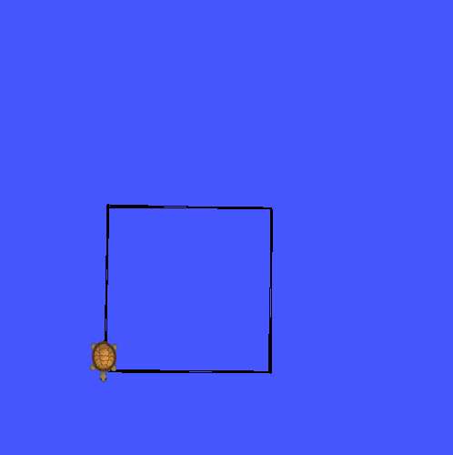
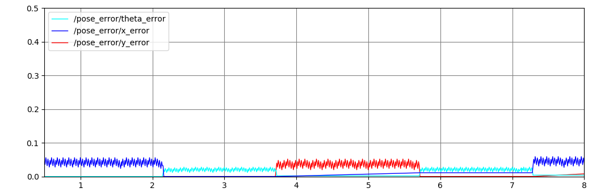

# Description
This package is used to control the turtlesim simulation. It uses feedforward control to drive the turtle in a rectangle based on the parameters set in the yaml file. It also calculates and plots the positional error.

# How to run:
Copy the following into a console window: </br>
```roslaunch tsim trect.launch```

Optional parameters:
- plot_gui (default True): Set to false to not launch the error plot

```
├── config
│   └── turtle_rect_params.yaml - parameters the determine the turtle trajectory
├── launch
│   └── trect.launch - main launch file to call to use package
├── msg
│   └── PoseError.msg - custom message to publish positional error values
└── src
    └── turtle_rect.cpp - main source file for turtle_rect node

```

# Results
[Video Link](https://youtu.be/aji3aDB8LBI)




