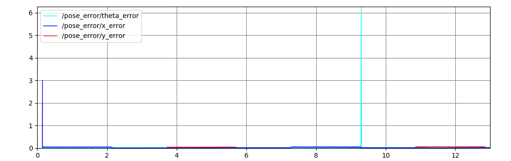

# tsim Description
This package is used to control the turtlesim simulation.

# How to run:
`roslaunch tsim trect.launch` - It uses feedforward control to drive the turtle in a rectangle based on the parameters set in the yaml file. It also calculates and plots the positional error.

`roslaunch tsim turtle_pent.launch` - Drives the turtle in a pentagon using the Waypoints and DiffDrive classes from rigid2d.

`roslaunch tsim trutle_odom.launch` - Uses `fake_diff_encoders` and `odometer` nodes to control a diff drive robot in rviz to mimic the turtle. (This launch file includes `turtle_pent.launch`)


```
├── config
│   └── turtle_rect_params.yaml - parameters the determine the turtle trajectory
├── launch
│   ├── trect.launch
│   ├── turtle_odom.launch
│   └── turtle_pent.launch
├── msg
│   └── PoseError.msg - custom message to publish positional error values
└── src
    ├── turtle_rect.cpp - main source file for turtle_rect node
    └── turtle_way.cpp - main source file for turtle_way node

```

# Results

## For `turtle_rect.launch`
[Video Link](https://youtu.be/aji3aDB8LBI)





## For `turtle_pent.launch`


## For `turtle_odom.launch`
[Video link](https://youtu.be/058QKyPgfmI)
